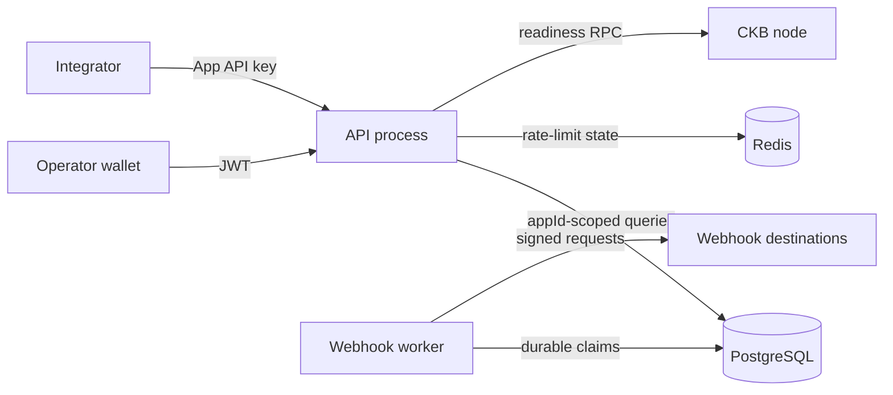

# Trust and tenant boundaries

Internet clients, webhook destinations, CKB RPC providers, and telemetry collectors are untrusted. PostgreSQL is authoritative. Redis is disposable coordination state. Secrets enter through environment variables or mounted files and must never enter logs, health responses, job payloads, or webhook payloads.

`App` is the infrastructure tenant. API-key middleware resolves exactly one `appId`; controllers do not accept tenant identity from request bodies. Repository reads, writes, cursors, idempotency keys, events, audit records, jobs, and webhook records remain app-scoped. Administrative cross-tenant access requires wallet authentication, an allowlisted admin identity, and audit logging.

Operator wallet authentication manages infrastructure ownership; it is not a product-user identity domain. Participant identities on agreements remain opaque external IDs owned by the integrating application.
