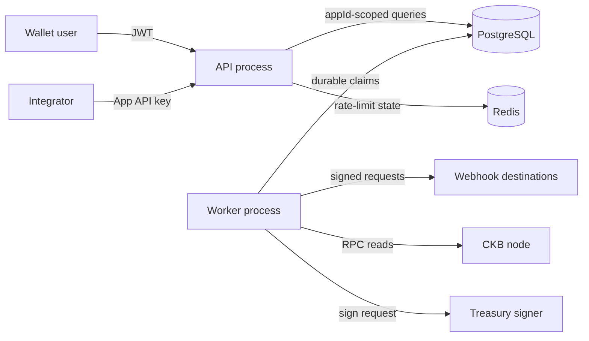

# Trust and tenant boundaries

Internet clients, webhook destinations, CKB RPC providers, forum providers, price providers, and telemetry collectors are untrusted external systems. PostgreSQL is authoritative. Redis is disposable coordination state. Secrets enter through the environment or mounted files and must never enter logs, health responses, job payloads, or webhook payloads.

The infrastructure tenant is `App`. API-key middleware establishes exactly one `appId`; controllers do not accept tenant identity from request bodies. Repository reads, writes, cursor lookups, idempotency keys, events, audit records, and webhook records remain app-scoped. Administrative cross-tenant access requires wallet authentication, an allowlisted admin identity, and an audit record.
