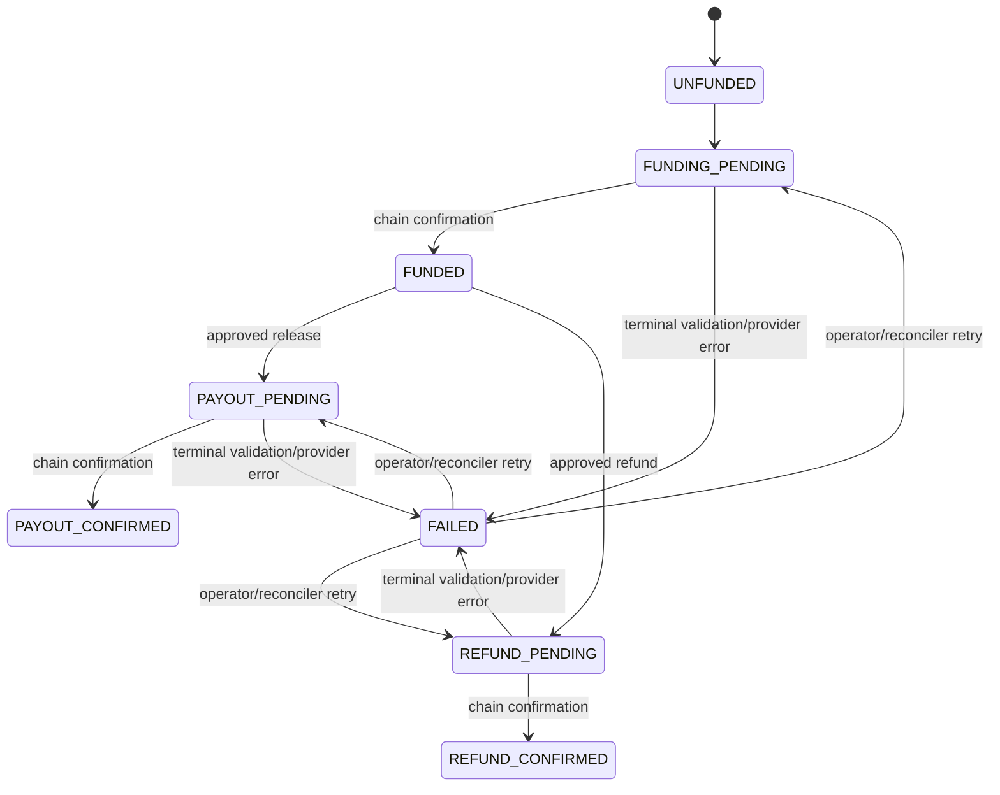

# Settlement guarantees and failure modes

PactAgent guarantees application-level idempotency and durable recording of settlement intent. It does not guarantee third-party RPC uptime, instant chain inclusion, stable fees, or irreversible finality before the configured chain considers a transaction committed.

Timeouts and connection loss after submission are ambiguous: reconciliation checks the persisted transaction before retrying. Insufficient capacity, invalid scripts, signer rejection, and malformed transactions are terminal until configuration or data changes. CKB RPC unavailability can block `/ready` through `REQUIRE_SETTLEMENT_READY=true`; production defaults to this policy. Manual database edits do not constitute settlement and are prohibited.
