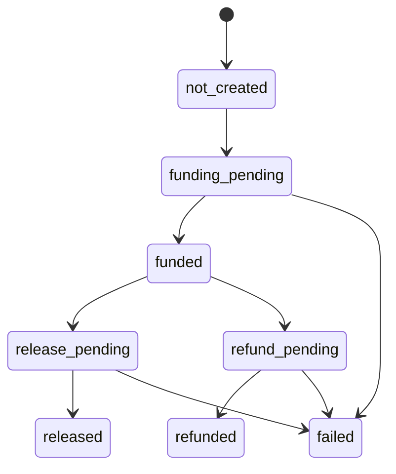

# Settlement boundary

Phase 1 exposes a rail-neutral escrow lifecycle and durable transaction records. It does not claim automated on-chain settlement.

The `mock` adapter performs deterministic sandbox transitions. The `manual` adapter records state coordinated by an external operator. The `ckb` adapter is an explicit placeholder that rejects operations with `escrow_adapter_not_ready` until Phase 2 supplies construction, signing, confirmation, and reconciliation behavior.

The API records intent and idempotent application transitions; a database status is never evidence of chain finality. Full CKB settlement must preserve this separation and reconcile ambiguous RPC outcomes before retrying.
