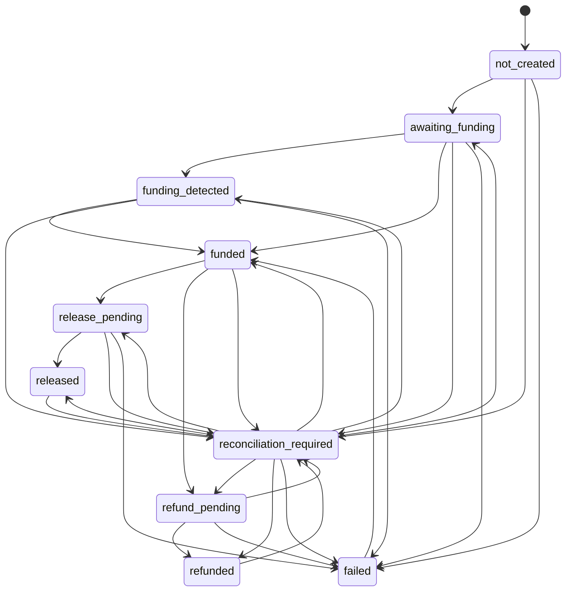

# Settlement boundary

The rail-neutral escrow lifecycle uses compare-and-swap transitions and durable transaction records. Database state records intent and observation; it is never treated as independent proof of CKB finality.

The `mock` adapter performs deterministic sandbox transitions. The `manual` adapter records state coordinated by an external operator. The `ckb` adapter builds contract-compatible commitments, signs through an isolated provider, broadcasts outside database transactions, independently verifies funding and settlement outputs, and leaves ambiguous results in `reconciliation_required`.

Creation and settlement use reserve/external/finalize phases so no row lock is held across RPC work. A durable `CKB_RECONCILE_TRANSACTION` job observes pending/committed/confirmed/rejected/unknown state, persists block and confirmation data, verifies the exact expected input/output, and raises explicit reorg state if a prior confirmation disappears. One active escrow is allowed per agreement or milestone scope; CKB escrows are milestone-scoped and must exactly match the milestone amount.

`failed` means the settlement outcome is unresolved, not that the scope is safe to reuse. Both `failed` and `reconciliation_required` remain active for uniqueness, so creating a replacement escrow returns `active_escrow_exists` until reconciliation establishes a safe state. Only `released` and `refunded` are resolved outcomes, and either can re-enter `reconciliation_required` if chain observation later detects a reorg.

The local signer is for development testnet only. Deployed CKB remains disabled until an external signer, transaction-level VM contract tests, and successful controlled testnet lifecycle evidence are available.
